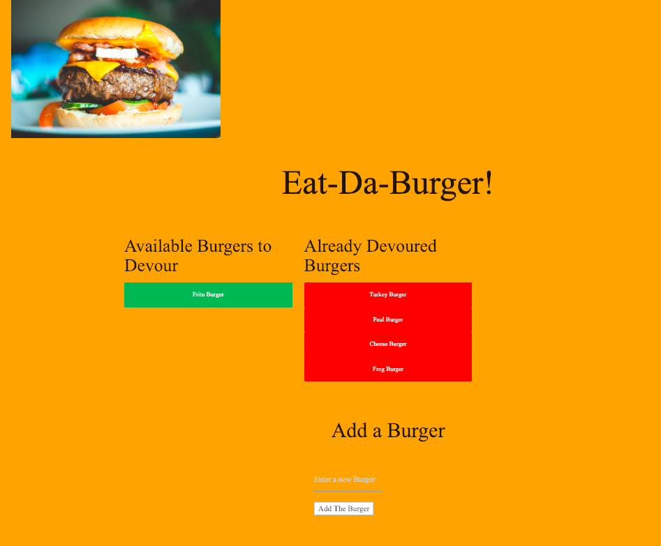
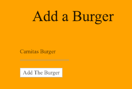
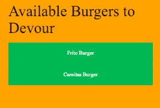
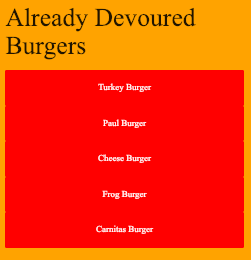

# burgers

Overview

In this assignment, we've create a burger logger with MySQL, Node, Express, Handlebars and a homemade ORM (yum!). We follow the MVC design pattern; use Node and MySQL to query and route data in your app, and Handlebars to generate the HTML.

Users are displayed a number of seeded burgers which the can "devour" by clicking the button (this actrion moves the button from right to left).  The can also click a button to add a new burger which they can then proceed to "devour".

The MVC model was used to build this where the:

The model contains JavaScript to retrive and manipulate data
The view files contain the presentation layer information to display the information to the user
The controller file listens to events triggered by the view (or another external source) and executes the appropriate reaction to these events.
Addtionally an ORM file sits between the application and the database and determines which specific data is retrieved or updated.

Here is the main screen of the app:

Here you can add a burger:

Here is the added burger:

You can then devour the burger which moves it to the right:

This app can be launched on:

https://pure-plains-25078.herokuapp.com/
